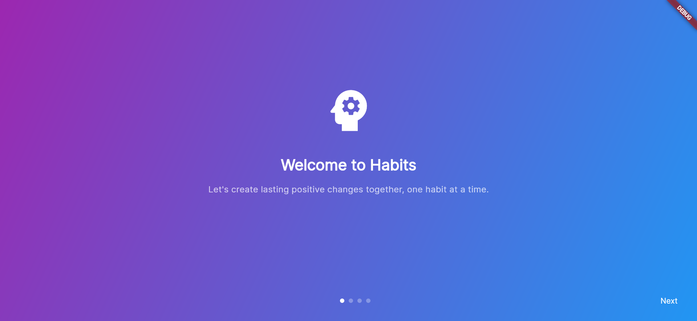
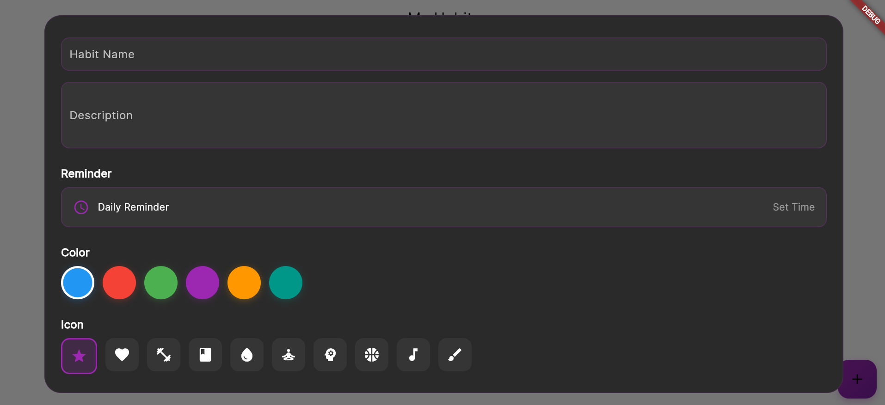

# Daily Habits Tracker

A modern Flutter application designed to help users build and maintain positive daily habits.

## ✨ Features

- 📝 **Habit Management**
  - Create, edit, and delete habits
  - Customize with icons and colors
  - Add descriptions and notes

- ⏰ **Reminders**
  - Set daily reminders
  - Customizable notification times
  - Smart notification handling

- 📊 **Progress Tracking**
  - Daily completion tracking
  - Streak counting
  - Progress statistics

- 🎨 **Modern UI/UX**
  - Material Design 3
  - Dark/Light theme support
  - Smooth animations
  - Intuitive gestures

- 💾 **Data Management**
  - Local SQLite database
  - Data persistence
  - Efficient state management

## 🚀 Getting Started

### Prerequisites

- Flutter SDK (3.0.0 or higher)
- Dart SDK (3.0.0 or higher)
- Android Studio / VS Code
- Git

### Installation

```bash
# Clone the repository
git clone https://github.com/gitarber/habits_tracker.git

# Navigate to project directory
cd habits_tracker

# Install dependencies
flutter pub get

# Run the app
flutter run
```

## 📱 Screenshots

<div align="center">
  <div style="display: flex; flex-wrap: wrap; gap: 10px; justify-content: center;">
    
    
    
  </div>
  
  <div style="display: flex; flex-wrap: wrap; gap: 10px; justify-content: center; margin-top: 10px;">
    
    
    
  </div>
</div>

### Features Showcase

| Feature | Description |
|---------|-------------|
| 🏠 **Home Screen** | Clean interface showing all your habits |
| ➕ **Add Habit** | Intuitive form for creating new habits |
| 📊 **Statistics** | Visual representation of your progress |
| 🌙 **Dark Theme** | Easy on the eyes dark mode |
| 🔔 **Notifications** | Customizable reminder system |
| 📝 **Habit Details** | Detailed view of each habit |

## 🏗️ Architecture

```
lib/
├── models/         # Data models
├── providers/      # State management
├── screens/        # App screens
├── services/       # Business logic
├── widgets/        # UI components
└── main.dart       # Entry point
```

## 🛠️ Built With

- **Flutter** - UI framework
- **Provider** - State management
- **SQLite** - Local database
- **Local Notifications** - Reminders
- **Material Design 3** - UI components

## 📦 Dependencies

```yaml
dependencies:
  flutter:
    sdk: flutter
  provider: ^6.1.1
  sqflite: ^2.3.0
  path: ^1.8.3
  flutter_local_notifications: ^16.3.0
  fl_chart: ^0.66.0
  shared_preferences: ^2.2.2
  intl: ^0.19.0
  google_fonts: ^6.1.0
  uuid: ^4.2.2
```

## 🤝 Contributing

Contributions are welcome! Please feel free to submit a Pull Request.

## 📄 License

This project is licensed under the MIT License - see the [LICENSE](LICENSE) file for details.

## 👤 Author

Arber Shquti
- GitHub: [@gitarber](https://github.com/gitarber)
- Portfolio: [gitarber.github.io](https://gitarber.github.io)

## ⭐ Show your support

Give a ⭐️ if this project helped you! 